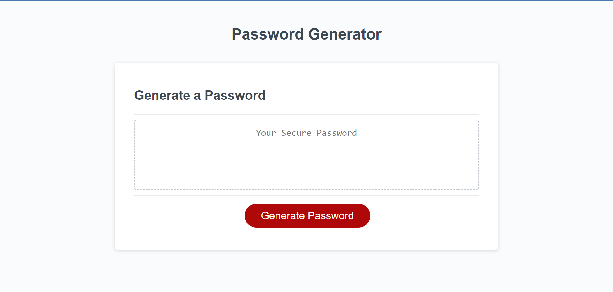
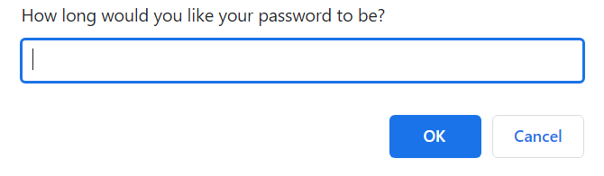

# Password-generator

## Description

The main objective was to create an application that would randomly generate a password that satisfies the users demands. The main reason for this is to ensure safety for the users accounts on different websites as well as to deter hackers from getting into said accounts since the passwords are a string of randomly generated characters. The following below are the objectives that were needed to be accomplished for this project:

## Objectives
GIVEN I need a new, secure password
WHEN I click the button to generate a password
THEN I am presented with a series of prompts for password criteria
WHEN prompted for password criteria
THEN I select which criteria to include in the password
WHEN prompted for the length of the password
THEN I choose a length of at least 8 characters and no more than 128 characters
WHEN asked for character types to include in the password
THEN I confirm whether or not to include lowercase, uppercase, numeric, and/or special characters
WHEN I answer each prompt
THEN my input should be validated and at least one character type should be selected
WHEN all prompts are answered
THEN a password is generated that matches the selected criteria
WHEN the password is generated
THEN the password is either displayed in an alert or written to the page

## Installation

1.  Download VSCode if not already (Download link: https://code.visualstudio.com/download).
2.  Install the extensions that will help you get the most of this application (Chrome DevTools, HTML CSS Support, JavaScript).
3.  For Windows users, download Git Bash. Mac users can use the terminal on thier machine.
4.  Ensure that you have a GitHub account and if not, create one to access the files (Link to GitHub website: https://github.com/)

## Usage

The users can apply this feature for various websites to ensure that their accounts are secure and safe, since it doesn't repeat the same output each time. For developers, they can use the Chrome DevTools extension to look into the code as the application is running to see how the code is working. (For Mac: Command+Option+I | For Windows: Control+Shift+I). From there, the developer will be able to see the fully commented JavaScript code, in addition to the CSS rules applied to the application, being able to test and alter the existing code to understand the functionality.

```md



```

## License
N/A